# Master Entity Relationship Diagram (ERD) PPDS ERP - Enterprise Edition

Dokumen ini mendefinisikan hubungan antar-entitas (Entity Relationship) pada sistem PPDS ERP. Untuk menjamin kesiapan skala produksi multi-tenant dan konsistensi data yang tinggi, skema database dirancang dengan isolasi `pondok_id` di tingkat root, relasi referensial bertingkat (`ON DELETE RESTRICT ON UPDATE CASCADE`), penjejakan audit, serta pembukuan keuangan _Double-Entry_.

---

## 1. Bagan ERD Master (Mermaid)

```mermaid
erDiagram
    %% Multi-Tenancy Root
    pondoks ||--o{ periodes : "memiliki"
    pondoks ||--o{ users : "memiliki"
    pondoks ||--o{ master_roles : "memiliki"
    pondoks ||--o{ master_permissions : "memiliki"
    pondoks ||--o{ bloks : "memiliki"
    pondoks ||--o{ kamars : "memiliki"
    pondoks ||--o{ santri : "memiliki"
    pondoks ||--o{ santri_room_histories : "memiliki"
    pondoks ||--o{ seksis : "memiliki"
    pondoks ||--o{ program_kerjas : "memiliki"
    pondoks ||--o{ inventaris : "memiliki"
    pondoks ||--o{ surats : "memiliki"
    pondoks ||--o{ invoices : "memiliki"
    pondoks ||--o{ setoran_seksi : "memiliki"
    pondoks ||--o{ kas_pondok_mutasis : "memiliki"
    pondoks ||--o{ accounts : "memiliki"
    pondoks ||--o{ journal_entries : "memiliki"
    pondoks ||--o{ perizinans : "memiliki"
    pondoks ||--o{ pelanggarans : "memiliki"
    pondoks ||--o{ registrasi_barangs : "memiliki"
    pondoks ||--o{ lab_billing_sessions : "memiliki"
    pondoks ||--o{ lab_pos_items : "memiliki"
    pondoks ||--o{ approval_requests : "memiliki"
    pondoks ||--o{ notifications : "memiliki"
    pondoks ||--o{ files : "memiliki"
    pondoks ||--o{ audit_logs : "memiliki"
    pondoks ||--o{ diniyah_curriculums : "memiliki"
    pondoks ||--o{ diniyah_schedules : "memiliki"
    pondoks ||--o{ diniyah_grades : "memiliki"
    pondoks ||--o{ wajar_attendances : "memiliki"
    pondoks ||--o{ murottil_hafalans : "memiliki"
    pondoks ||--o{ media_publications : "memiliki"
    pondoks ||--o{ musyawarahs : "memiliki"
    pondoks ||--o{ rekam_medis : "memiliki"
    pondoks ||--o{ apotek_obats : "memiliki"
    pondoks ||--o{ buku_tamus : "memiliki"
    pondoks ||--o{ kbr_transactions : "memiliki"
    pondoks ||--o{ kbr_stocks : "memiliki"
    pondoks ||--o{ takmir_jadwals : "memiliki"
    pondoks ||--o{ pembangunan_proyeks : "memiliki"
    pondoks ||--o{ bump_transaksis : "memiliki"
    pondoks ||--o{ stock_movements : "memiliki"
    pondoks ||--o{ document_sequences : "memiliki"

    %% Core & RBAC Modul
    periodes ||--o{ user_roles : "memiliki"
    periodes ||--o{ program_kerjas : "memiliki"
    periodes ||--o{ surats : "memiliki"
    periodes ||--o{ invoices : "memiliki"
    periodes ||--o{ perizinans : "memiliki"
    periodes ||--o{ pelanggarans : "memiliki"
    periodes ||--o{ approval_requests : "memiliki"
    periodes ||--o{ audit_logs : "memiliki"
    periodes ||--o{ registrasi_barangs : "memiliki"
    periodes ||--o{ diniyah_curriculums : "memiliki"
    periodes ||--o{ diniyah_schedules : "memiliki"
    periodes ||--o{ diniyah_grades : "memiliki"
    periodes ||--o{ wajar_attendances : "memiliki"
    periodes ||--o{ murottil_hafalans : "memiliki"
    periodes ||--o{ media_publications : "memiliki"
    periodes ||--o{ musyawarahs : "memiliki"
    periodes ||--o{ kas_pondok_mutasis : "memiliki"
    periodes ||--o{ rekam_medis : "memiliki"
    periodes ||--o{ buku_tamus : "memiliki"
    periodes ||--o{ kbr_transactions : "memiliki"
    periodes ||--o{ takmir_jadwals : "memiliki"
    periodes ||--o{ pembangunan_proyeks : "memiliki"
    periodes ||--o{ bump_transaksis : "memiliki"
    periodes ||--o{ setoran_seksi : "memiliki"
    periodes ||--o{ santri_room_histories : "memiliki"
    periodes ||--o{ stock_movements : "memiliki"
    periodes ||--o{ document_sequences : "memiliki"
    periodes ||--o{ journal_entries : "memiliki"

    users ||--o{ user_roles : "memiliki"
    users ||--o{ task_assignments : "ditugaskan"
    users ||--o{ audit_logs : "melakukan"
    users ||--o{ media_publications : "menerbitkan"
    users ||--o{ musyawarah_votes : "memilih"
    users ||--o{ buku_tamus : "ditemui"
    users ||--o{ files : "mengunggah"
    users ||--o{ approval_histories : "menyetujui"
    users ||--o{ setoran_seksi : "memverifikasi"
    users ||--o{ inventaris_mutations : "mencatat"

    %% Enterprise RBAC & Sessions
    master_roles ||--o{ role_permissions : "memiliki"
    master_permissions ||--o{ role_permissions : "diberikan_ke"
    master_roles ||--o{ user_roles : "diberikan_ke"
    users ||--o{ user_sessions : "memiliki"

    %% Santri & Wilayah
    bloks ||--o{ kamars : "memiliki"
    kamars ||--o{ santri : "menempati"
    santri ||--o{ invoices : "menerima"
    santri ||--o{ perizinans : "mengajukan"
    santri ||--o{ pelanggarans : "melakukan"
    santri ||--o{ registrasi_barangs : "memiliki"
    santri ||--o{ diniyah_grades : "menerima"
    santri ||--o{ wajar_attendances : "memiliki"
    santri ||--o{ murottil_hafalans : "melakukan"
    santri ||--o{ rekam_medis : "memiliki"
    santri ||--o{ santri_room_histories : "memiliki_riwayat"
    kamars ||--o{ santri_room_histories : "tercatat_di"

    %% Organisasi & Seksi
    seksis ||--o{ program_kerjas : "menjalankan"
    seksis ||--o{ inventaris : "memegang"
    seksis ||--o{ disposisi : "menerima"
    seksis ||--o{ setoran_seksi : "menyetor"
    users ||--o{ program_kerjas : "penanggung_jawab"

    %% Persetujuan & Notifikasi
    approval_requests ||--o{ approval_steps : "memiliki"
    approval_requests ||--o{ approval_histories : "memiliki"
    master_roles ||--o{ approval_steps : "diperlukan_untuk"
    notifications ||--o{ notification_targets : "dikirim_ke"
    users ||--o{ notification_targets : "menerima"

    %% File Lampiran & Media
    files ||--o{ attachments : "menunjuk"
    program_kerjas ||--o{ attachments : "melampirkan"
    surats ||--o{ attachments : "melampirkan"
    perizinans ||--o{ attachments : "melampirkan"

    %% Kesekretariatan Persuratan
    surats ||--o{ disposisi : "didisposisikan"

    %% Pendidikan
    diniyah_curriculums ||--o{ diniyah_schedules : "dijadwalkan"
    diniyah_curriculums ||--o{ diniyah_grades : "dinilai"

    %% Kesehatan & Apotek Pivot
    rekam_medis ||--o{ rekam_medis_obats : "memerlukan"
    apotek_obats ||--o{ rekam_medis_obats : "digunakan_pada"

    %% Inventaris Mutations
    inventaris ||--o{ inventaris_mutations : "mengalami"

    %% Laboratorium & POS Lab Detail
    users ||--o{ lab_billing_sessions : "operator"
    lab_billing_sessions ||--o{ lab_pos_transactions : "memicu"
    lab_pos_transactions ||--o{ lab_pos_transaction_items : "memiliki"
    lab_pos_items ||--o{ lab_pos_transaction_items : "terjual_pada"

    %% KBR Minimarket POS Detail
    kbr_transactions ||--o{ kbr_transaction_items : "memiliki"
    kbr_stocks ||--o{ kbr_transaction_items : "terjual_pada"

    %% Musyawarah & Rapat
    musyawarahs ||--o{ musyawarah_votes : "memiliki"

    %% Akuntansi Double-Entry Ledger
    journal_entries ||--o{ journal_details : "memiliki"
    accounts ||--o{ journal_details : "tercatat_di"
```

---

## 2. Struktur Entitas & Relasi Berdasarkan Modul

### A. Multi-Tenancy & Core Infrastructure

- **`pondoks`**: Entitas tertinggi multi-tenant untuk mendukung penggunaan multi-cabang (Putra/Putri/Pusat) secara terisolasi.
- **`periodes`**: Mengisolasi semua transaksi operasional tahun ajaran/periode tertentu.
- **`users`**: Data master kredensial pengurus.
- **`master_roles`**: Daftar peranan hak akses (misalnya: `Ketua Umum`, `Kasie Keamanan`).
- **`master_permissions`**: Matriks hak akses detail tingkat operasional (misalnya: `izin_approve`, `skkb_create`).
- **`role_permissions`**: Tabel penghubung antara roles dan granular permissions.
- **`user_roles`**: Mengikat user ke role tertentu di periode tertentu dengan pencatatan SK pengangkatan (`appointment_letter`), tanggal mulai (`appointed_at`), dan tanggal selesai (`ended_at`).
- **`user_sessions`**: Session token dinamis untuk keamanan login pengurus.
- **`system_settings`**: Konfigurasi global aplikasi PPDS.
- **`task_assignments`**: Penugasan harian dinamis untuk petugas teknis (misal: petugas penerima barang, gerbang perizinan).
- **`seksis`**: Daftar departemen/seksi pondok (Bendahara, Keamanan, PLP, dsb).

### B. Santri, Kamar & Riwayat Wilayah

- **`bloks` & `kamars`**: Struktur pembagian wilayah tempat tinggal santri.
- **`santri`**: Data induk santri, terikat pada kamar dan periode aktif.
- **`santri_room_histories`**: Log riwayat mutasi perpindahan kamar santri dari tanggal awal hingga akhir dalam satu periode.

### C. Keuangan & Akuntansi _Double-Entry_

- **`program_kerjas`**: Rencana program kerja per seksi yang memuat anggaran biaya (RAB).
- **`invoices`**: Tagihan SPP & iuran bulanan santri dengan proteksi constraint unik bisnis.
- **`setoran_seksi`**: Setoran dana pendapatan usaha dari seksi ke Bendahara.
- **`kas_pondok_mutasis`**: Buku kas besar pondok untuk mencatat mutasi debit/kredit secara sederhana.
- **`accounts` (Chart of Accounts)**: Kode perkiraan akun akuntansi standar (Asset, Liability, Equity, Revenue, Expense).
- **`journal_entries` & `journal_details`**: Jurnal akuntansi double-entry presisi tinggi untuk memastikan keseimbangan Debit/Kredit atas seluruh transaksi keuangan (SPP, Setoran Usaha, Pembangunan, BUMP, KBR).

### D. Keamanan & Ketertiban

- **`perizinans`**: Izin keluar masuk pondok santri.
- **`pelanggarans`**: Catatan poin dan sanksi pelanggaran santri.
- **`registrasi_barangs`**: Pendaftaran barang bawaan berharga santri (seperti sepeda motor, laptop, kompor).

### E. Pendidikan & Al-Qur'an (Pendidikan, Wajar, Murottil)

- **`diniyah_curriculums`**: Mata pelajaran kurikulum madrasah diniyah.
- **`diniyah_schedules`**: Jadwal pelajaran, ustadz, dan kelas diniyah, terikat ke `diniyah_curriculums` (subject).
- **`diniyah_grades`**: Hasil nilai ujian harian, semesteran, dan rapor diniyah santri, terikat ke `diniyah_curriculums` (subject).
- **`wajar_attendances`**: Presensi kehadiran program wajib belajar (wajar).
- **`murottil_hafalans`**: Setoran hafalan ayat/juz santri serta evaluasi kelancarannya.

### F. Kesehatan & Apotek (Pivot)

- **`rekam_medis`**: Riwayat pengobatan, kunjungan poskestren, alergi, dan rujukan santri.
- **`apotek_obats`**: Inventaris stok obat-obatan di Poskestren.
- **`rekam_medis_obats`**: Tabel pivot untuk mencatat jenis obat dan kuantitas (`qty`) yang diberikan per sesi rekam medis.

### G. Kesekretariatan & Persuratan

- **`surats`**: Surat masuk dan surat keluar pondok.
- **`disposisi`**: Catatan instruksi dewan harian ke seksi, terhubung dari `surats` ke `seksis`.

### H. Musyawarah & Rapat

- **`musyawarahs` & `musyawarah_votes`**: Voting dewan harian secara real-time atas usulan/draft bahasan kebijakan atau RAB.

### I. Laboratorium & POS Lab Detail

- **`lab_billing_sessions` & `lab_pos_transactions`**: Pencatatan billing PC internet dan transaksi kasir POS cetak/copy.
- **`lab_pos_items`**: Inventaris item POS lab (kertas print, jilid, laminating).
- **`lab_pos_transaction_items`**: Tabel detail item terjual dalam transaksi POS Lab beserta kuantitas dan harga jual riil.

### J. KBR Minimarket POS Detail

- **`kbr_transactions`**: Transaksi POS Minimarket KBR.
- **`kbr_stocks`**: Stok barang dagangan minimarket.
- **`kbr_transaction_items`**: Tabel detail item terjual dalam transaksi KBR beserta kuantitas dan harga jual riil.

### K. Inventaris & Mutasi

- **`inventaris`**: Master data barang milik seksi.
- **`inventaris_mutations`**: Log mutasi barang (kerusakan, perpindahan lokasi, dsb) yang mencatat pengurus (`users`) penanggung jawab mutasi.

### L. Penjejakan Stok Terpusat (Stock Movements)

- **`stock_movements`**: Log mutasi stok terpolimorfisasi (`item_type`: Apotek/KBR/Inventaris/Dapur) untuk menjejak mutasi masuk, keluar, kerusakan, dan penyesuaian stok secara presisi.

### M. Infrastruktur Enterprise

- **`document_sequences`**: Generator nomor dokumen/surat otomatis (auto-numbering sequence).
- **`system_events`**: Antrean event system (event queue) untuk notifikasi asinkron dan pemicu workflow.
- **`backup_logs`**: Log metadata backup berkala database pondok.
- **`schema_migrations`**: Log versi migrasi database untuk keperluan tim pengembang.
- **`approval_requests`, `approval_steps`, `approval_histories`**: Engine persetujuan berantai global (multistage approval) dengan referensi FK terikat ke `master_roles.id`.
- **`notifications`, `notification_targets`**: Pengiriman notifikasi ke target user tertentu.
- **`files`**: Penyimpanan berkas fisik terpusat yang diunggah oleh `users` dengan fitur soft-delete (`deleted_at`).
- **`attachments`**: Polimorfik junction table menjembatani berkas ke dokumen entitas (surat, RAB, perizinan).
- **`audit_logs`**: Rekaman log aktivitas perubahan sensitif di sistem (siapa, melakukan apa, kapan, pada data apa).
